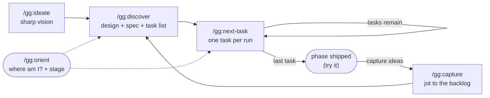

<p align="center">
  <picture>
    
  </picture>
</p>

**The speed of vibe-coding. The memory of spec-driven development. None of the ceremony of either. Just agentic engineering, done right.**

`gg` will save you months of figuring out how to build real, maintainable software with Claude Code.

`gg` is a small Claude Code plugin: five Markdown slash commands (`/gg:ideate`, `/gg:discover`, `/gg:next-task`, `/gg:capture`, `/gg:orient`) that build your whole product in one first pass and then let you refine it. Every decision lives on disk and each task runs in its own clean session, so the context never rots and the next one always knows what's going on. No hooks, no background process: you run a command when you want it, and the rest of the time it stays out of your way.

---

## You've probably lived this

**Day one is magic.** You open Claude Code, describe the thing you want, and you just prompt. And it works. Not perfectly, but a whole running app, far better than a paragraph of English had any right to produce. You sit back grinning. This is the future.

**Day four is the hangover.** You come back to add a feature or smooth a rough edge. Claude reopens the project, skims whatever files it guesses are relevant, and gets to work. It builds what you asked for, and quietly breaks two things you didn't. Every nuance you carefully explained on day one is *gone*. None of it was written down, so each session starts from zero, re-deriving (and contradicting) calls you already made. You end up explaining your own project to it. Again.

**So you go looking for a better way, and you find a whole category of it.** Spec-driven development: [Spec-Kit](https://github.com/github/spec-kit), [GSD](https://github.com/gsd-build/get-shit-done), [Superpowers](https://claude.com/plugins/superpowers), and more. At first it feels like salvation. Now *everything* is documented. A vision, a plan, a constitution, tasks, all written down for the agent to read before it touches a line of code. The amnesia is cured.

**Until you feel the cost.** Building a product from scratch now means a long run of phases (specify, clarify, plan, tasks, approve each document, then build) to arrive at something close to what a single prompt already handed you on day one. And from then on, every change, large or small, goes through the same ritual. It gets the job done. It just asks for far more effort than the result seems to need.

There's the trap: vibe-coding is fast but forgetful; spec-driven remembers but is heavy. You shouldn't have to pick.

---

## gg is the third option

**Iteration 0 builds the whole product**, fast, like that first magical prompt. But it grills you first (one sharp question at a time), designs the entire thing up front, and writes it all down as it goes: the vision, the architecture, and **every default it had to assume because it didn't stop to ask you.** You end up with a complete, running product to actually try, *and* a paper trail of why it is the way it is, so it stays maintainable instead of becoming a black box.

**Then you refine a real, running product.** You don't re-run a spec ceremony. You jot notes as you use it ("make this bigger", "add that", "this is wrong"), and gg folds a batch of them into the next phase. The design memory is always there, so it stops breaking what it shouldn't. And because it knows your product isn't live yet, it won't pile on defensive work that a product in development simply doesn't need.

**And it stays out of your way.** gg is five Markdown commands and nothing else: no hooks, no background agents, no installer beyond adding the plugin. You invoke a command when you want it, and when you don't, it does nothing at all. The only trace it leaves in your repo is a plain-text `.gg/` folder you can read and commit.

**The magic lives entirely in those five carefully crafted commands.** Distilled from months of building real products with agents: what works, what quietly breaks or creates friction, and how to land the exact product in your head, with its full memory, at the least effort possible.

---

## Where gg fits

| | Plain Claude Code | Spec-Kit | GSD | Superpowers | **gg** |
|---|:---:|:---:|:---:|:---:|:---:|
| **Time to a first *whole* product** | instant, undocumented | full spec flow | plan-per-unit | brainstorm, design, plan | **one grilled cycle** |
| **Design & nuances kept on disk** | ✗ lost each session | ✓ | ✓ | ✓ per feature | ✓ vision + blueprint + glossary + ADRs |
| **Records the defaults the AI assumed** | ✗ | ✗ | ✗ | ✗ | ✓ numbered & reversible |
| **Effort per change (any size)** | low, but risky | full workflow | full workflow | full workflow | **low: a note, one pass** |
| **Footprint** | just Claude | CLI + templates | installer + subagents | plugin + subagents | **5 Markdown commands, on demand** |

*These are all good tools that genuinely solve the memory problem. gg just makes a different bet: the whole product first, fully documented, then a light loop with no machinery in the way.*

---

## Quick start

In Claude Code:

```
/plugin marketplace add javimoya/gg
/plugin install gg@javimoya
```

Then, from inside the folder of the project you want to build:

```
/gg:ideate      # turn your idea into a sharp vision
```

Every step ends with a one-line breadcrumb telling you exactly what to run next.

> Lost, or back after a break? Run **`/gg:orient`**. It reads your project, says where you are and what to do next, and (only if you say so) flips the dev/launched stage. Otherwise it changes nothing.

---

## How it works



A **phase** is one `discover, then next-task*` cycle. **Phase 0** builds the whole product; **phase 1, 2, …** each fold in a batch of notes you captured. Run each command in its own clean Claude session, with `/clear` between, to keep the context sharp.

1. **`/gg:ideate`** runs once and turns the idea into a sharp VISION.
2. **`/gg:discover`** designs the whole product (a BLUEPRINT: data model and architecture), grills the load-bearing questions, records good defaults for the rest, and produces a testable SPEC plus an ordered task list.
3. **`/gg:next-task`** builds exactly the next task, with tests, then checkpoints and stops. Run it again for the next one. You try the product only when the last task closes the phase; between tasks, the agent verifies its own work.
4. When you want changes, **`/gg:capture`** them as you go, then run **`/gg:discover`** again. It asks which notes to include, grills them, and `next-task` builds them. Repeat.

---

## When you can run each command

`gg` is strict about ordering: each command **refuses out of turn** and points you to the right one.

| Command | Run it… |
|---|---|
| **`/gg:ideate`** | to **start** a project (no `.gg/` yet) — or to **resume** an unfinished ideation (`state: visioning`). Once per project. |
| **`/gg:discover`** | right after `ideate` (phase 0), **or** after a phase ships **when there are pending notes** (phase N). |
| **`/gg:next-task`** | after `discover`, or after a previous `next-task`, while the current phase still has tasks left. |
| **`/gg:capture`** | once a product exists, during `next-task` or between phases. *Not* during ideate/discover (raise it in the grilling instead). |
| **`/gg:orient`** | any time. Read-only, plus it offers the `dev ↔ launched` stage flip. |

---

## What it creates: the `.gg/` folder

Everything the workflow knows lives in a `.gg/` folder at the root of your project. It's the durable memory that lets clean sessions hand work off to each other, a fixed, flat set of files no matter how big the project gets:

```
.gg/
├── PRINCIPLES.md     # the constitution (the quality bar), copied at kickoff
├── VISION.md         # the complete destination: what "done and perfect" means
├── ROADMAP.md        # the dispatch header: state · phase · stage · phase log
├── BLUEPRINT.md      # the whole-product design (data model + architecture), decided up front
├── ASSUMPTIONS.md    # the recorded-defaults ledger (every choice not grilled, reversible)
├── SPEC.md           # the living contract: acceptance criteria with typed evidence
├── PROGRESS.md       # the task board for the current phase + where to resume
├── NOTES.md          # the refinement backlog (pending / applied), triaged by discover
├── RUNBOOK.md        # the pinned run/verify commands (full suite, deliverable, destructive paths)
├── CONTEXT.md        # a glossary of your project's domain terms
├── JOURNAL.md        # append-only history; phase-close entries are the hand-offs
└── adr/              # Architecture Decision Records (the "why" behind big calls)
```

Commit this folder alongside your code. Anyone (you tomorrow, a teammate, or a fresh agent) can run `/gg:orient` and carry on.

---

## The rules that make it work

Enforced by `PRINCIPLES.md` (the constitution) and the commands themselves.

- **Decompose, don't drop, or set a boundary.** "Later" becomes a task, a note, or a recorded assumption. Genuinely out of scope? It goes into the VISION as an approved boundary. It never just disappears.
- **Good defaults, recorded and reversible.** Discovery asks the load-bearing questions and logs the rest as numbered assumptions you can veto at sign-off or overturn later with a note. The cut is the *unrecorded* assumption, not the default.
- **dev ≠ launched.** In a spec-driven build, the agent burns whole phases on migrations, backward-compatibility, and preservation that a product with no users yet doesn't need. gg knows it isn't live and skips that defensive work until you launch.
- **Verify before you claim.** A per-project `RUNBOOK.md` pins the exact full-suite command; a phase closes only when it's green and the real deliverable runs. You try it at the phase close.
- **Capture, don't stash.** Ideas go into `.gg/NOTES.md`, never the agent's private memory. Nothing the project should remember lives outside `.gg/`.
- **One task per run, resumable everywhere.** `/gg:next-task` does exactly one task, records "where to resume" in `PROGRESS.md`, and stops. `/clear` and run it again. The on-disk state *is* the handoff.

---

## Managing the plugin

```
/plugin marketplace update javimoya     # pull the latest version
/plugin                                 # open the menu to enable/disable/uninstall
/plugin marketplace remove javimoya     # remove the marketplace entirely
```

Developing locally? Point the marketplace at your checkout instead of GitHub:

```
/plugin marketplace add /path/to/gg
/plugin install gg@javimoya
```

## Requirements

- [Claude Code](https://claude.com/claude-code), via the CLI, desktop app, or IDE extension.
- The commands inherit your session's model (`model: inherit`) and never auto-invoke (`disable-model-invocation: true`). Tune `model:` and `effort:` in any `commands/*.md` to taste.

---

## FAQ

**Is this a library or framework I import?** No. It's a set of Markdown instructions that steer Claude Code. There's no runtime and nothing to import.

**Does it run hooks or anything in the background?** No. gg is five Markdown commands you invoke by hand. When you don't call one, it does nothing. The only thing it leaves in your repo is the plain-text `.gg/` folder.

**Does it work for any language or stack?** Yes, it's stack-agnostic. The commands talk about a blueprint, specs, tests, and deliverables; you bring the language.

**Do I try the product between tasks?** No, only at the **end of a phase** (its last task). Between tasks the agent runs its own tests and checks; you don't babysit it task by task.

**Is there an audit or a wrap step?** No, `gg` deliberately has neither. Verification is the green test suite at the phase close, the runnable deliverable you try, and a self-accounting gate. And there's nothing to "wrap": `/gg:next-task` checkpoints to `PROGRESS.md` every run, so you just `/clear` and run it again.

**Why clean sessions and `/clear` between steps?** Long sessions degrade. Each task is sized to fit one fresh session, and the `.gg/` files carry the state across, so you're always working with a sharp context.

---

## Changelog

See [CHANGELOG.md](CHANGELOG.md) for what changed in each version.

## License

MIT, see [LICENSE](LICENSE).
