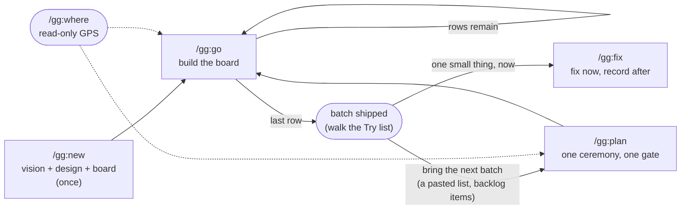

<p align="center">
  <picture>
    
  </picture>
</p>

**The speed of vibe-coding. The memory of spec-driven development. None of the ceremony of either. Just agentic engineering, done right.**

`gg` will save you months of figuring out how to build real, maintainable software with Claude Code.

`gg` is a small Claude Code plugin: five Markdown slash commands (`/gg:new`, `/gg:plan`, `/gg:go`, `/gg:fix`, `/gg:where`) that build your whole product in one first pass and then let you refine it in low-ceremony batches. Every decision lives on disk in seven small, bounded files; every task runs in a clean session that orients itself in seconds — so the context never rots and the next session always knows what's going on. History lives in git, not in journals: gg writes down what's *live*, and deletes what's done. No hooks, no background process: you run a command when you want it, and the rest of the time it stays out of your way.

---

## You've probably lived this

**Day one is magic.** You open Claude Code, describe the thing you want, and you just prompt. And it works. Not perfectly, but a whole running app, far better than a paragraph of English had any right to produce. You sit back grinning. This is the future.

**Day four is the hangover.** You come back to add a feature or smooth a rough edge. Claude reopens the project, skims whatever files it guesses are relevant, and gets to work. It builds what you asked for, and quietly breaks two things you didn't. Every nuance you carefully explained on day one is *gone*. None of it was written down, so each session starts from zero, re-deriving (and contradicting) calls you already made. You end up explaining your own project to it. Again.

**So you go looking for a better way, and you find a whole category of it.** Spec-driven development: [Spec-Kit](https://github.com/github/spec-kit), [GSD](https://github.com/gsd-build/get-shit-done), [Superpowers](https://claude.com/plugins/superpowers), and more. At first it feels like salvation. Now *everything* is documented. The amnesia is cured.

**Until you feel the cost.** Every change, large or small, goes through the same ritual — and half of what the agent writes each session is documentation about the work instead of the work. It gets the job done. It just asks for far more effort (and far more tokens) than the result seems to need.

There's the trap: vibe-coding is fast but forgetful; spec-driven remembers but is heavy. You shouldn't have to pick.

---

## gg is the third option

**One kickoff builds the whole product.** `/gg:new` grills you first (one sharp question at a time, always leading with its recommendation), designs the entire thing up front — the data model, the architecture, the seams — and writes down **every default it assumed because it didn't stop to ask you**, numbered and reversible. You end up with a complete, running product to actually try, *and* a paper trail of why it is the way it is.

**Then you refine in batches, at the ceremony each change deserves.** You use the product, you collect what you want changed — four bugs, a tweak, one real feature — and you bring the whole list to `/gg:plan`: **one ceremony, one gate**. Decided bugs get zero questions and zero paperwork; the feature with real design weight gets the full grilling. `/gg:go` builds the batch with tests, one row per run, and closes on evidence — a green suite and *you* walking the load-bearing flows. And when something just needs fixing *now*, `/gg:fix` fixes it now and records it in one line — no board, no batch, no gate.

**And it stays out of your way.** gg is five Markdown commands and nothing else. The only trace it leaves in your repo is a plain-text `.gg/` folder of **seven bounded files** you can read in one sitting — because everything that's *done* is deleted from them, and git remembers it forever. gg v3 was redesigned from the measured evidence of its own v2 in production: 309 real sessions where ~45% of everything the agent wrote was documentation ceremony. v3 exists to spend those tokens on your product instead.

---

## Where gg fits

| | Plain Claude Code | Spec-driven tools | **gg** |
|---|:---:|:---:|:---:|
| **Time to a first *whole* product** | instant, undocumented | full spec flow | **one grilled arc** |
| **Design & nuances kept on disk** | ✗ lost each session | ✓ ever-growing docs | ✓ seven bounded files, history in git |
| **Records the defaults the AI assumed** | ✗ | ✗ | ✓ numbered & reversible |
| **Effort per change** | low, but risky | full workflow every time | **scales with the change: a bug is one row, a feature is a grilling** |
| **A "just fix it" lane** | that's all it has | ✗ | ✓ `/gg:fix` — fix now, record after |
| **Footprint** | just Claude | CLI/templates/subagents | **5 Markdown commands, on demand** |

---

## Quick start

In Claude Code:

```
/plugin marketplace add javimoya/gg
/plugin install gg@javimoya
```

Type `/gg` — you should see the five commands offered in the slash-command menu.

Then, from inside the folder of the project you want to build:

```
/gg:new         # idea → sharp vision → whole-product design → batch-0 board, one arc
```

Every step ends with a one-line breadcrumb telling you exactly what to run next.

> Lost, or back after a break? Run **`/gg:where`**. It reads your project, says where you are and what to run next, and changes nothing — ever.

Prefer a guided first run? **[Your first project with gg](TUTORIAL.md)** walks you through building a small product end to end.

---

## How it works



A **batch** is one `plan → go*` cycle. **Batch 0** is the whole product; each later batch folds in whatever you brought to `/gg:plan`.

1. **`/gg:new`** runs once: brainstorm → grilling → whole-product design → recorded defaults → the batch-0 board. It also asks, once, how commits and deploys run. Full spec: [`commands/new.md`](commands/new.md).
2. **`/gg:go`** builds the next board row to the full bar, with tests — one row per run, folding in scope you want *now*, checkpointing `WORK.md` so `/clear` always resumes cleanly — and closes the batch on evidence: a green suite and you walking the **Try list**. When the plan designed the batch as **delegated**, the same session orchestrates instead: independent rows build in parallel subagents, each in its own git worktree, while it integrates each one (merged-tree suite green before the next lands), relays their questions to you, and keeps the record — spec: [`gg-shared/DELEGATION.md`](gg-shared/DELEGATION.md). Full spec: [`commands/go.md`](commands/go.md).
3. **`/gg:plan`** opens the next batch from whatever you bring — pasted ideas, bugs, backlog items — weighs each **S/M/L**, grills only what has design weight, and takes **one consolidated veto gate**. It also decides the batch's execution shape: rows that admit it are designed for delegation (disjoint surfaces, explicit dependencies), vetoable at that same gate. Full spec: [`commands/plan.md`](commands/plan.md).
4. **`/gg:fix`** fixes a small decided change *now*, runs the suite green, records one line — and routes honestly to `/gg:plan` if it grows design weight. Full spec: [`commands/fix.md`](commands/fix.md).
5. **`/gg:where`** reconstructs where you are — read-only, always. `--audit` adds a deeper integrity check. Full spec: [`commands/where.md`](commands/where.md).

An idea that surfaces mid-build never derails it: any session jots it as a `B-NN` into the backlog in two lines, returns to work — and offers it back at the next checkpoint: fold it into the live batch, or leave it for a later plan. A **research batch** (`kind: question`) designs an experiment instead of a capability and closes honestly on the measured answer — yes, no, and inconclusive all count.

---

## When you can run each command

`gg` is strict about ordering: each command **refuses out of turn** and points you to the right one.

| Command | Run it… |
|---|---|
| **`/gg:new`** | to **start** a project (no `.gg/` yet) — or to **resume** an unfinished kickoff. Once per project. |
| **`/gg:plan`** | when the board is empty and you have the next batch in hand — one item or ten. Also re-scopes a batch in place when a show changed the plan. |
| **`/gg:go`** | while the board has pending rows: after `new`, after `plan`, after a previous `go`. Also folds new scope into the live batch when you want it *now*. |
| **`/gg:fix`** | any time, in any state — one small, decided, local change, fixed now. |
| **`/gg:where`** | any time. Read-only, changes nothing. |

---

## What it creates: the `.gg/` folder

Seven bounded files plus `adr/` — readable whole, committed with your code. Nothing in them grows forever: what's done is deleted, and git is the archive.

```
.gg/
├── WORK.md       # the hot file: state · the batch board · Try list · provenance · where to resume · fix log
├── BACKLOG.md    # future work only (New / Later), stable B-NN ids minted from its next-id counter
├── PRODUCT.md    # the destination: what it is / is NOT, "done and perfect" clauses (✓-marked when observed)
├── DESIGN.md     # the current-truth design: data model, architecture, seams — edited in place
├── NOTES.md      # open assumptions (A-NN) + live findings (F-NN); swept at each close
├── CONTEXT.md    # a glossary of your project's domain terms
├── RUNBOOK.md    # the pinned run/verify commands (full suite, destructive paths)
└── adr/          # Architecture Decision Records (the "why" behind hard-to-reverse calls)
```

The method itself (the quality bar, the grilling protocol, the formats) lives in the plugin — it is never copied into your project.

---

## The rules that make it work

Enforced by `gg-shared/METHOD.md` and the commands themselves.

- **Decompose, don't drop.** "Later" becomes a board row, a backlog item, or a recorded assumption. Genuinely out of scope? A boundary in `PRODUCT.md`, decided out loud. It never just disappears.
- **Good defaults, recorded and reversible.** Grilling asks the load-bearing questions and logs the rest as numbered assumptions you can veto at the gate or overturn later with a note. The cut is the *unrecorded* assumption.
- **Ceremony scales with the change.** A decided bug is one board row with zero questions. A feature with design weight gets the full grilling. The classification is visible at the gate (S/M/L, each with its why) so nothing heavy hides in the light lane.
- **Verify before you claim.** `RUNBOOK.md` pins the exact full-suite command; a batch closes only when it's green and *you* walked the Try list. A user-triggered write path is verified through the real route, end to end.
- **History is git's job.** No journals, no archives, no changelogs. A close deletes the consumed records and (if you allowed it) commits — `git log -S "B-12"` recovers anything, and `git revert` is the rollback.
- **Resumable everywhere.** Every row checkpoints `WORK.md` ("where to resume"); `/clear` + `/gg:go` picks up exactly there. The on-disk state *is* the handoff.

---

## How to manage the plugin

```
/plugin marketplace update javimoya     # pull the latest version
/plugin                                 # open the menu to enable/disable/uninstall
/plugin marketplace remove javimoya     # remove the marketplace entirely
```

Developing locally? Point the marketplace at your checkout instead of GitHub:

```
/plugin marketplace add /path/to/gg
/plugin install gg@javimoya
```

## Requirements

- [Claude Code](https://claude.com/claude-code), via the CLI, desktop app, or IDE extension.
- The commands inherit your session's model (`model: inherit`) and never auto-invoke (`disable-model-invocation: true`). Tune `model:` and `effort:` in any `commands/*.md` to taste.
- A git repo is strongly recommended (gg's history lives there); `/gg:new` offers `git init` if you don't have one.

---

## FAQ

**Is this a library or framework I import?** No. It's a set of Markdown instructions that steer Claude Code. There's no runtime and nothing to import.

**Does it run hooks or anything in the background?** No. gg is five Markdown commands you invoke by hand. When you don't call one, it does nothing. The only thing it leaves in your repo is the plain-text `.gg/` folder.

**Does gg commit my code?** Only if you let it — you set the policy once at kickoff (see "How it works"). Commits are always pathspec-scoped to gg's own changes — your uncommitted work is never swept in — and gg never pushes.

**Coming from gg v2?** v3 is a clean break: five commands instead of seven, seven state files instead of fifteen, history in git instead of journals and archives. `CONVERSION.md` in this repo is a step-by-step conversion an AI session can run against your existing `.gg/`.

**Does it work for any language or stack?** Yes, it's stack-agnostic. The commands talk about a design, a board, tests, and deliverables; you bring the language.

**What about open-ended or experimental projects?** Batch 0 settles the irreversible foundation, designs extension points where a property genuinely can't be known yet, and names the riskiest open question. From there, a batch can be a **research batch** — an experiment that closes on what it *learned* (yes, no, or inconclusive — all honest), recorded as a citable finding that can even correct the destination, with a paper trail instead of a quiet scope cut.

**Do I try the product between tasks?** At the **shows** — watchable slices `/gg:plan` places mid-batch, where the product's felt character first becomes judgeable and your look can still change the remaining rows — and at the **batch close**, where you walk the Try list (a show is never the last row: the close *is* the batch's final look). Between those, the agent runs its own tests and checks; you don't babysit it row by row.

**Why clean sessions and `/clear`?** Long sessions degrade. Rows are sized to fit one fresh session — `/gg:go` builds one row per run and stops; whether to `/clear` before the next run is your call — and `WORK.md` carries the state across, so you're always working with a sharp context.

---

## Changelog

See [CHANGELOG.md](CHANGELOG.md) for what changed in each version.

## License

MIT, see [LICENSE](LICENSE).
