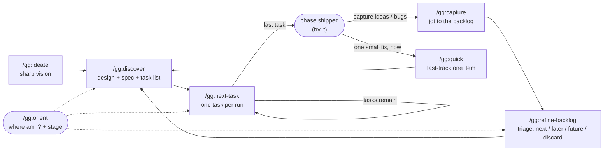

<p align="center">
  <picture>
    
  </picture>
</p>

**The speed of vibe-coding. The memory of spec-driven development. None of the ceremony of either. Just agentic engineering, done right.**

`gg` will save you months of figuring out how to build real, maintainable software with Claude Code.

`gg` is a small Claude Code plugin: seven Markdown slash commands (`/gg:ideate`, `/gg:discover`, `/gg:next-task`, `/gg:refine-backlog`, `/gg:capture`, `/gg:quick`, `/gg:orient`) that build your whole product in one first pass and then let you refine it. Every decision lives on disk and each task runs in its own clean session, so the context never rots and the next one always knows what's going on. No hooks, no background process: you run a command when you want it, and the rest of the time it stays out of your way.

---

## You've probably lived this

**Day one is magic.** You open Claude Code, describe the thing you want, and you just prompt. And it works. Not perfectly, but a whole running app, far better than a paragraph of English had any right to produce. You sit back grinning. This is the future.

**Day four is the hangover.** You come back to add a feature or smooth a rough edge. Claude reopens the project, skims whatever files it guesses are relevant, and gets to work. It builds what you asked for, and quietly breaks two things you didn't. Every nuance you carefully explained on day one is *gone*. None of it was written down, so each session starts from zero, re-deriving (and contradicting) calls you already made. You end up explaining your own project to it. Again.

**So you go looking for a better way, and you find a whole category of it.** Spec-driven development: [Spec-Kit](https://github.com/github/spec-kit), [GSD](https://github.com/gsd-build/get-shit-done), [Superpowers](https://claude.com/plugins/superpowers), and more. At first it feels like salvation. Now *everything* is documented. A vision, a plan, a constitution, tasks, all written down for the agent to read before it touches a line of code. The amnesia is cured.

**Until you feel the cost.** Building a product from scratch now means a long run of phases (specify, clarify, plan, tasks, approve each document, then build) to arrive at something close to what a single prompt already handed you on day one. And from then on, every change, large or small, goes through the same ritual. It gets the job done. It just asks for far more effort than the result seems to need.

There's the trap: vibe-coding is fast but forgetful; spec-driven remembers but is heavy. You shouldn't have to pick.

---

## gg is the third option

**Iteration 0 builds the whole product**, fast, like that first magical prompt. But it grills you first (one sharp question at a time), designs the entire thing up front, and writes it all down as it goes: the vision, the architecture, and **every default it had to assume because it didn't stop to ask you.** You end up with a complete, running product to actually try, *and* a paper trail of why it is the way it is, so it stays maintainable instead of becoming a black box.

**Then you refine a real, running product.** You don't re-run a spec ceremony. You jot notes as you use it ("make this bigger", "add that", "this is wrong"), and you triage a batch of them into the next phase. The design memory is always there, so it stops breaking what it shouldn't. And because it knows your product isn't live yet, it won't pile on defensive work that a product in development simply doesn't need.

**And it stays out of your way.** gg is seven Markdown commands and nothing else: no hooks, no background agents, no installer beyond adding the plugin. You invoke a command when you want it, and when you don't, it does nothing at all. The only trace it leaves in your repo is a plain-text `.gg/` folder you can read and commit.

**The magic lives entirely in those seven carefully crafted commands.** Distilled from months of building real products with agents: what works, what quietly breaks or creates friction, and how to land the exact product in your head, with its full memory, at the least effort possible.

---

## Where gg fits

| | Plain Claude Code | Spec-Kit | GSD | Superpowers | **gg** |
|---|:---:|:---:|:---:|:---:|:---:|
| **Time to a first *whole* product** | instant, undocumented | full spec flow | plan-per-unit | brainstorm, design, plan | **one grilled cycle** |
| **Design & nuances kept on disk** | ✗ lost each session | ✓ | ✓ | ✓ per feature | ✓ vision + blueprint + glossary + ADRs |
| **Records the defaults the AI assumed** | ✗ | ✗ | ✗ | ✗ | ✓ numbered & reversible |
| **Effort per change (any size)** | low, but risky | full workflow | full workflow | full workflow | **low: a note, one pass** |
| **Footprint** | just Claude | CLI + templates | installer + subagents | plugin + subagents | **7 Markdown commands, on demand** |

*These are all good tools that genuinely solve the memory problem. gg just makes a different bet: the whole product first, fully documented, then a light loop with no machinery in the way.*

---

## Quick start

In Claude Code:

```
/plugin marketplace add javimoya/gg
/plugin install gg@javimoya
```

Then, from inside the folder of the project you want to build:

```
/gg:ideate      # turn your idea into a sharp vision
```

Every step ends with a one-line breadcrumb telling you exactly what to run next.

> Lost, or back after a break? Run **`/gg:orient`**. It reads your project, says where you are and what to do next, and (only if you say so) flips the dev/launched stage. Otherwise it changes nothing.

---

## How it works



A **phase** is one `discover, then next-task*` cycle. **Phase 0** builds the whole product; **phase 1, 2, …** each fold in the backlog items you triaged into them. Run each command in its own clean Claude session, with `/clear` between, to keep the context sharp.

1. **`/gg:ideate`** runs once and turns the idea into a sharp VISION.
2. **`/gg:discover`** designs the whole product (a BLUEPRINT: data model and architecture), grills the load-bearing questions, records good defaults for the rest, and produces a testable SPEC plus an ordered task list.
3. **`/gg:next-task`** builds exactly the next task, with tests, then checkpoints and stops. Run it again for the next one. You try the product at the phase's **shows** — watchable slices placed where its character first (and next) becomes judgeable, the first as early as the riskiest discovered target allows, so a wrong target shows up early — and you give the decisive verdict when the last task closes the phase; between those the agent verifies its own work and you don't babysit it task by task. If a show reveals the phase is aimed wrong, **`/gg:discover`** re-scopes the *current* phase in place — keeping the done tasks, redesigning the rest — instead of waiting for the next phase.
4. When you want changes, **`/gg:capture`** them as you go (ideas or bugs) — they land in the backlog (`.gg/BACKLOG.md`), never the agent's memory. (Already sure one belongs next? **`/gg:capture --next`** queues it straight into `## Next phase`, self-triaged, without designing it yet — that's still `discover`'s or `quick`'s job.)
5. Between phases, **`/gg:refine-backlog`** reviews the backlog in **one report** — each item with a recommended disposition (next phase / later / future / discard) — so you decide in a single step: accept the recommendations, send only the bugs, send everything, or override item by item. Then **`/gg:discover`** designs the set you queued and **`/gg:next-task`** builds it. Repeat. A refinement phase can be a *build* phase (capabilities, bugs) or a *research* phase — a search that runs an experiment and closes on what it **learned** (a reported finding, even a negative one) and can correct the destination itself from evidence, so a project whose spec is discovered by doing fits the same loop.
6. Spotted one small thing — a bug, a tweak — you want to do now (a phase just shipped, nothing else queued)? **`/gg:quick`** is the express lane: it records that single item straight into the next phase (no triage step) and runs `discover` on it immediately, then you `/gg:next-task` to build it. Same bar (it's recorded, designed, and tested like any phase); less ceremony, for a change you've already decided on. In any other state it just files the note like `/gg:capture`; for a batch, use `capture` + `refine-backlog`.

---

## What it looks like on real projects

The loop never changes — `ideate → discover → next-task`, then `capture / refine-backlog / quick` to refine. What changes is how the **dials** turn: how deep the grilling goes, how many phases there are, whether a phase *builds* or *searches*, and whether you're in `dev` or `launched`. Four sketches across very different shapes (the projects are invented; the shapes are real).

### `sift` — a CLI that files your Downloads by rules you write

**Small and already-decided.** There's not much to discover here, and you don't want a spec marathon for a 300-line tool.

```
/gg:ideate            # idea: a CLI that files ~/Downloads into folders by rules I write
/gg:discover          # phase 0 = the whole tool: one BLUEPRINT (rule schema + dry-run model),
                      #   a SPEC, ~5 tasks, one show at the dry-run output
/gg:next-task   (×5)  # spine first (the rule engine), then the show, then --apply and polish
#  → ship: a tool you actually run

/gg:capture "support an ~/.siftrc so rules live in one place"   # lands in the backlog for later
/gg:quick   "files with no extension get skipped — fix"         # one decided change:
                      #   records + designs + builds it as a micro-phase, no triage
```

Here **phase 0 *is* the product**, and `/gg:quick` is your everyday lane. The ceremony stays proportional — a short grilling, a handful of tasks, one show.

### `Dispatchly` — multi-tenant scheduling & dispatch for field-service crews

**Gigantic and multi-quarter.** You can't (and shouldn't) build the whole feature set in phase 0. You build a *spine*, then steer for months.

```
/gg:ideate            # multi-tenant scheduling + dispatch for HVAC / plumbing crews
/gg:discover          # phase 0 settles only the LOAD-BEARING foundation: the tenancy model,
                      #   the data model, the auth + dispatch seams — then drives ONE thin vertical
                      #   (create job → assign tech → tech sees it) to an early show. Not every feature.
/gg:next-task  (×N)   # phase 0 ships a real, usable spine — not a stub, not the whole backlog

#  → then, for months, you steer with the backlog:
/gg:capture  ...           # jot relentlessly as the team uses it
/gg:refine-backlog         # one report → a coherent phase: "recurring jobs + SMS reminders"
/gg:discover / next-task   # BLUEPRINT frozen; each phase APPENDS its design impact — extend, never migrate
#  … phases 1‥12: billing, offline mobile mode, route optimization, audit log, SSO …

/gg:orient            # the day the first crew goes live, flip dev → launched —
                      #   now migration & backward-compat questions become real, and discovery asks them
```

Phase 0 buys a **working spine, not the feature set.** A frozen-then-extended BLUEPRINT and a flat `.gg/` keep a twelve-phase product legible; `refine-backlog` is the steering wheel; the `dev → launched` flip changes what discovery even asks.

### `Warrens` — a roguelike dungeon generator whose levels must *feel* "tense but fair"

**Open-ended.** The character can't be written down up front; you discover it by looking. gg handles this without dropping the no-cuts bar.

```
/gg:ideate            # a procedural dungeon generator; levels should feel tense but fair
/gg:discover          # phase 0 settles the irreversible foundation (the tile/graph model) and designs an
                      #   EXTENSION POINT — a registry of room archetypes — because the set that feels good
                      #   isn't knowable yet. Names the riskiest open question ("does the tension read as
                      #   fair, or cheap?") and drives a thin vertical to an EARLY, walkable show.
/gg:next-task         # the first show lands as early as the foundation allows — because "fun" is only
                      #   judgeable by playing, you LOOK here, not at the end

#  → you play, you capture: "rooms feel samey", "loot pacing is off"
/gg:refine-backlog    # recognizes an item isn't a build — it's an open question → a RESEARCH phase
/gg:discover          # designs the SEARCH, not a feature: the experiment, the harness, the signal.
                      #   Acceptance is REPORTED — it can close honestly even on "mix B felt cheap"
/gg:next-task         # runs it, records a FINDING (F-NN); a result can even correct the VISION's
                      #   target via a traceable R-NN — never a quiet scope cut
```

You can't spec "fun," so phase 0 settles **only the foundation + an extension point** and races to an early look. From there the loop **alternates build and research phases**, and the destination itself is correctable from evidence.

### `Lookout` — semantic search over a company's internal docs

**Research-first.** Already shipped, but retrieval quality stalled. You don't guess your way out — you run a search and close on what you *learned*.

```
#  Lookout is live, but precision plateaued. Investigate instead of cargo-culting a fix.
/gg:capture "search misses obvious docs — precision@5 feels ~0.6"
/gg:refine-backlog    # this isn't a feature to build — it's an open question → a RESEARCH phase
/gg:discover          # designs the search: hypothesis ("a reranker clears 0.8"), the experiment,
                      #   the eval harness, the signal (precision@5 on a labeled set). Acceptance = REPORTED
/gg:next-task         # runs the experiment, writes the FINDING:
                      #   "reranking → 0.74; the real bottleneck is chunking" — a near-negative, honestly closed
#  → the finding redirects the next phase (fix chunking) and corrects the VISION's target via R-NN
```

gg treats **"we don't know yet" as a first-class phase**, not a detour. A research phase closes on what it *learned* — yes, no, and inconclusive are all honest — records it as a citable finding, and can move the goalposts *with a paper trail* instead of quietly.

> **The loop is the same every time.** What differs is the dials: a one-show phase 0 for a CLI vs. a load-bearing spine for a SaaS; a handful of tasks vs. a dozen phases; `dev` vs. `launched`; a `build` phase vs. a `research` one. You learn the seven commands once and they fit a 300-line script and a multi-quarter platform alike.

---

## When you can run each command

`gg` is strict about ordering: each command **refuses out of turn** and points you to the right one.

| Command | Run it… |
|---|---|
| **`/gg:ideate`** | to **start** a project (no `.gg/` yet) — or to **resume** an unfinished ideation (`state: visioning`). Once per project. |
| **`/gg:discover`** | right after `ideate` (phase 0), **or** after a phase ships once `## Next phase` is queued — via `refine-backlog` (a batch) or `quick` (one item) (phase N, a *build* or *research* phase). |
| **`/gg:next-task`** | after `discover`, or after a previous `next-task`, while the current phase still has tasks left. |
| **`/gg:refine-backlog`** | after a phase ships, to triage the backlog — one reviewed report, then a single decision (next / later / future / discard) — before the next `discover`. |
| **`/gg:capture`** | once a product exists, during `next-task` or between phases. *Not* during ideate/discover (raise it in the grilling instead). Add **`--next`** to queue the item straight into `## Next phase` (self-triage, skip `refine-backlog`) instead of `## New` — without designing it (that's `quick`). |
| **`/gg:quick`** | after a phase ships with nothing else queued, to fast-track **one** small change you've decided to do: it records the item and runs `discover` on it, skipping triage. A batch? Use `capture` + `refine-backlog` instead. |
| **`/gg:orient`** | any time. Read-only, plus it offers the `dev ↔ launched` stage flip. |

---

## What it creates: the `.gg/` folder

Everything the workflow knows lives in a `.gg/` folder at the root of your project. It's the durable memory that lets clean sessions hand work off to each other, a fixed, flat set of files no matter how big the project gets:

```
.gg/
├── PRINCIPLES.md     # the constitution (the quality bar), copied at kickoff
├── VISION.md         # the complete destination: what "done and perfect" means (corrected from evidence via R-NN)
├── ROADMAP.md        # the dispatch header: state · phase · kind · stage · phase log
├── BLUEPRINT.md      # the whole-product design (data model + architecture), settled up front, extensible where open
├── ASSUMPTIONS.md    # the recorded-defaults ledger (open defaults only — every choice not grilled, reversible)
├── ASSUMPTIONS-ARCHIVE.md # closed defaults (consumed at a phase close / overridden) — kept for the trace
├── SPEC.md           # the living contract: acceptance criteria with typed evidence
├── PROGRESS.md       # the task board for the current phase + where to resume
├── BACKLOG.md        # the active backlog (new / next phase / later / future), triaged by refine-backlog (or fast-tracked by quick)
├── BACKLOG-ARCHIVE.md # closed backlog items (applied / discarded) — kept for the trace
├── FINDINGS.md       # observations of what the running product did (F-NN), created lazily
├── RUNBOOK.md        # the pinned run/verify commands (full suite, deliverable, destructive paths)
├── CONTEXT.md        # a glossary of your project's domain terms
├── JOURNAL.md        # append-only history; phase-close entries are the hand-offs
└── adr/              # Architecture Decision Records (the "why" behind big calls)
```

Commit this folder alongside your code. Anyone (you tomorrow, a teammate, or a fresh agent) can run `/gg:orient` and carry on.

---

## The rules that make it work

Enforced by `PRINCIPLES.md` (the constitution) and the commands themselves.

- **Decompose, don't drop, or set a boundary.** "Later" becomes a task, a backlog item, or a recorded assumption. Genuinely out of scope? It goes into the VISION as an approved boundary. It never just disappears.
- **Good defaults, recorded and reversible.** Discovery asks the load-bearing questions and logs the rest as numbered assumptions you can veto at sign-off or overturn later with a note. The cut is the *unrecorded* assumption, not the default.
- **dev ≠ launched.** In a spec-driven build, the agent burns whole phases on migrations, backward-compatibility, and preservation that a product with no users yet doesn't need. gg knows it isn't live and skips that defensive work until you launch.
- **Verify before you claim.** A per-project `RUNBOOK.md` pins the exact full-suite command; a phase closes only when it's green and the real deliverable runs. You try it at the phase's shows and at the phase close.
- **Capture, don't stash.** Ideas and bugs go into `.gg/BACKLOG.md`, never the agent's private memory. Nothing the project should remember lives outside `.gg/`.
- **One task per run, resumable everywhere.** `/gg:next-task` does exactly one task, records "where to resume" in `PROGRESS.md`, and stops. `/clear` and run it again. The on-disk state *is* the handoff.

---

## Managing the plugin

```
/plugin marketplace update javimoya     # pull the latest version
/plugin                                 # open the menu to enable/disable/uninstall
/plugin marketplace remove javimoya     # remove the marketplace entirely
```

Developing locally? Point the marketplace at your checkout instead of GitHub:

```
/plugin marketplace add /path/to/gg
/plugin install gg@javimoya
```

## Requirements

- [Claude Code](https://claude.com/claude-code), via the CLI, desktop app, or IDE extension.
- The commands inherit your session's model (`model: inherit`) and never auto-invoke (`disable-model-invocation: true`). Tune `model:` and `effort:` in any `commands/*.md` to taste.

---

## FAQ

**Is this a library or framework I import?** No. It's a set of Markdown instructions that steer Claude Code. There's no runtime and nothing to import.

**Does it run hooks or anything in the background?** No. gg is seven Markdown commands you invoke by hand. When you don't call one, it does nothing. The only thing it leaves in your repo is the plain-text `.gg/` folder.

**Does it work for any language or stack?** Yes, it's stack-agnostic. The commands talk about a blueprint, specs, tests, and deliverables; you bring the language.

**What about open-ended or experimental projects — where you can't spec the whole thing up front?** gg supports them without dropping the no-cuts bar. Phase 0 settles the irreversible foundation and designs the data model to *extend* (open maps / plug-points) where a property genuinely can't be known yet, then names the riskiest open question. From there a phase can be a **research** phase — a search that runs an experiment and closes on what it learned: its acceptance is *reported* (a measured answer — yes, no, or inconclusive — all honest closes, never a faked target), and the VISION's target itself can be corrected when a recorded finding proves it wrong (a traceable revision, never a quiet scope cut).

**Do I try the product between tasks?** At the phase's **shows**, not task by task: a `show` is a watchable slice `/gg:discover` places where the product's character becomes judgeable — the first as early as the foundation allows, so a wrong target surfaces early — plus the decisive try-it at the **phase close**. Between those the agent runs its own tests and checks; you don't babysit it task by task.

**Is there a mandatory audit or wrap step?** No — neither lives *in the loop*. Verification is the green test suite at the phase close, the runnable deliverable you try, and a self-accounting gate, not a separate audit phase. (One *optional*, read-only check exists for when you want it: `/gg:orient --audit` inspects the `.gg/` record's integrity — handy before a launch flip or after a hand-edit — and changes nothing.) And there's nothing to "wrap": `/gg:next-task` checkpoints to `PROGRESS.md` every run, so you just `/clear` and run it again.

**Why clean sessions and `/clear` between steps?** Long sessions degrade. Each task is sized to fit one fresh session, and the `.gg/` files carry the state across, so you're always working with a sharp context.

---

## Changelog

See [CHANGELOG.md](CHANGELOG.md) for what changed in each version.

## License

MIT, see [LICENSE](LICENSE).
