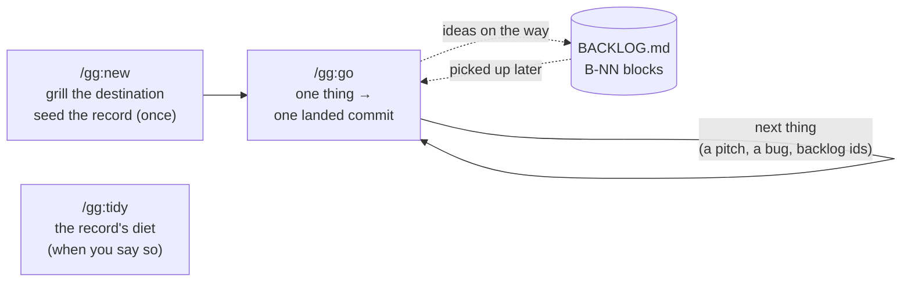

<p align="center">
  <picture>
    
  </picture>
</p>

**The speed of vibe-coding. The memory of spec-driven development. None of the ceremony of either. Just agentic engineering, done right.**

`gg` will save you months of figuring out how to build real, maintainable software with Claude Code.

`gg` is a small Claude Code plugin: three Markdown slash commands (`/gg:new`, `/gg:go`, `/gg:tidy`) built on one idea — **a record with habits, not a workflow engine**. The working loop (pitch, grill, build, review, ship) belongs to the conversation, where it's fastest; what gg fixes on disk is the part no session keeps well on its own: four small, bounded files that hold what's *currently true* about your product, stable ids for everything you've ever wanted, and one commit per change that carries the code and the record together. History lives in git, not in journals: gg writes down what's live, and deletes what's done. No hooks, no background process, no state machine.

---

## You've probably lived this

**Day one is magic.** You open Claude Code, describe the thing you want, and you just prompt. And it works. Not perfectly, but a whole running app, far better than a paragraph of English had any right to produce. You sit back grinning. This is the future.

**Day four is the hangover.** You come back to add a feature or smooth a rough edge. Claude reopens the project, skims whatever files it guesses are relevant, and gets to work. It builds what you asked for, and quietly breaks two things you didn't. Every nuance you carefully explained on day one is *gone*. None of it was written down, so each session starts from zero, re-deriving (and contradicting) calls you already made. You end up explaining your own project to it. Again.

**So you go looking for a better way, and you find a whole category of it.** Spec-driven development: [Spec-Kit](https://github.com/github/spec-kit), [GSD](https://github.com/gsd-build/get-shit-done), [Superpowers](https://claude.com/plugins/superpowers), and more. At first it feels like salvation. Now *everything* is documented. The amnesia is cured.

**Until you feel the cost.** Every change, large or small, goes through the same ritual — and half of what the agent writes each session is documentation about the work instead of the work. It gets the job done. It just asks for far more effort (and far more tokens) than the result seems to need.

There's the trap: vibe-coding is fast but forgetful; spec-driven remembers but is heavy. You shouldn't have to pick.

---

## gg is the third option

**Keep the memory. Drop the machine.** gg's earlier versions were a full workflow engine — batches, boards, gates, closes. Measured in production, the engine turned out to be the expensive half: ~40% of everything the agent edited was record upkeep, and nearly every gate answer was "yes, do what you recommended". Meanwhile the *record* — the design, the glossary, the backlog with stable ids, the decision log — kept earning its keep every single session. So v5 keeps exactly that half:

- **`/gg:new` kicks off a project** by grilling you — one sharp question at a time, always leading with its recommendation — until the destination and the load-bearing design are pinned. Then it seeds the record and gets out of the way. No board, no policy questionnaire.
- **`/gg:go` takes one thing from ask to landed commit.** A feature pitch, a bug (screenshot welcome), or backlog ids. It orients from the record in seconds, grills only what has design weight (a decided bug gets zero questions), builds at the size the change asks — directly when small, through implementation subagents when it spans layers, with every diff reviewed — proves it with a green suite, and lands **one commit carrying the code and the record together**, titled with the change's stable id.
- **`/gg:tidy` keeps the record honest**, when *you* decide it's time: it reads everything, reports what has gone stale or heavy, and prunes back to bounded current truth on your yes.

**And it stays out of your way.** gg is three Markdown commands and nothing else. The only trace in your repo is a plain-text `.gg/` folder of **four bounded files plus ADRs** you can read in one sitting — because everything that's *done* is deleted from them, and git remembers it forever.

---

## Where gg fits

| | Plain Claude Code | Spec-driven tools | **gg** |
|---|:---:|:---:|:---:|
| **Design & nuances kept on disk** | ✗ lost each session | ✓ ever-growing docs | ✓ four bounded files, history in git |
| **Effort per change** | low, but risky | full workflow every time | **scales with the change: a bug is zero questions, a feature is a grilling** |
| **Ideas & bugs get stable ids** | ✗ | varies | ✓ `B-NN`, minted in two lines, cited in commit titles |
| **Ceremony between you and a landed commit** | none, and it shows | boards, gates, phases | **one conversation, one commit** |
| **Footprint** | just Claude | CLI/templates/subagents | **3 Markdown commands, on demand** |

---

## Quick start

In Claude Code:

```
/plugin marketplace add javimoya/gg
/plugin install gg@javimoya
```

Type `/gg` — you should see the three commands offered in the slash-command menu.

Then, from inside the folder of the project you want to build:

```
/gg:new         # idea → grilled destination → seeded record → first /gg:go recommendation
```

Prefer a guided first run? **[Your first project with gg](TUTORIAL.md)** walks you through building a small product end to end.

---

## How it works



1. **`/gg:new`** runs once: brainstorm → grilling → the load-bearing design → the record seeded on disk. It ends by recommending the first slice to build. Full spec: [`commands/new.md`](commands/new.md).
2. **`/gg:go`** is the loop you live in. Bring one thing; it lands as one commit — code, tests, and the record edits it caused, together, citing the `B-NN`. Ideas that surface along the way are captured as two-line backlog blocks without derailing the work. Shipping follows the standing convention written in your RUNBOOK — decided once, honored every session. Full spec: [`commands/go.md`](commands/go.md).
3. **`/gg:tidy`** is maintenance on demand, never a ceremony: applied items swept, narrative pruned, stale entries rewritten, bounds enforced — report first, one yes, one commit. Full spec: [`commands/tidy.md`](commands/tidy.md).

The method the commands share — the quality bar, the evidence rules, the grilling protocol, the four file formats — is one file, [`gg-shared/GG.md`](gg-shared/GG.md), read from the plugin and never copied into your project.

---

## What it creates: the `.gg/` folder

Four bounded files plus `adr/` — plain Markdown, committed with your code. Nothing in them grows forever: what's done is deleted, and git is the archive.

```
.gg/
├── BACKLOG.md    # capture only: stable B-NN ids from one counter — the ask, never the story
├── DESIGN.md     # current-truth design, product essence & boundaries up top — edited in place
├── CONTEXT.md    # a glossary of your project's domain terms (and the words to avoid)
├── RUNBOOK.md    # the pinned commands: full suite, focused tests, and the standing Deploy convention
└── adr/          # Architecture Decision Records (the "why" behind hard-to-reverse calls)
```

---

## The rules that make it work

Enforced by [`gg-shared/GG.md`](gg-shared/GG.md) and the commands themselves.

- **One change, one commit, code + record together.** The commit title cites the `B-NN`; the body carries the root cause and the lesson. `git log -S "B-12"` answers "why is it like this?" forever — no journals needed.
- **Capture, never chronicle.** A backlog block is the ask in your words, minted in two lines mid-anything. The story of its fix belongs to the commit that landed it.
- **Ceremony scales with the change.** A decided bug gets zero questions. A feature with design weight gets the full grilling — one question at a time, recommendation first, explained plainly with concrete examples.
- **Verify before you claim.** The suite is green or you hear exactly what's red and why. A user-triggered write path is verified through the real route, end to end. Done means observed, never "should work".
- **History is git's job.** No journals, no archives, no changelogs. Applied backlog blocks are deleted in the commit that lands them; tidy deletes what went stale. Nothing is ever lost — it's all in git.
- **The record stays small because someone prunes it.** Bounds have teeth (BACKLOG/CONTEXT/RUNBOOK 32KB, DESIGN 64KB) — checked only by `/gg:tidy`, on your yes, so no working session burns tokens policing files.

---

## How to manage the plugin

```
/plugin marketplace update javimoya     # pull the latest version
/plugin                                 # open the menu to enable/disable/uninstall
/plugin marketplace remove javimoya     # remove the marketplace entirely
```

Developing locally? Point the marketplace at your checkout instead of GitHub:

```
/plugin marketplace add /path/to/gg
/plugin install gg@javimoya
```

## Requirements

- [Claude Code](https://claude.com/claude-code), via the CLI, desktop app, or IDE extension.
- The commands inherit your session's model (`model: inherit`) and never auto-invoke (`disable-model-invocation: true`). Tune `model:` and `effort:` in any `commands/*.md` to taste.
- A git repo is required in practice (gg's history lives there); `/gg:new` offers `git init` if you don't have one.

---

## FAQ

**Is this a library or framework I import?** No. It's a set of Markdown instructions that steer Claude Code. There's no runtime and nothing to import.

**Does it run hooks or anything in the background?** No. gg is three Markdown commands you invoke by hand. When you don't call one, it does nothing. The only thing it leaves in your repo is the plain-text `.gg/` folder.

**Does gg commit my code?** Yes — that's the point: one landed change is one commit carrying the code and the record together, always pathspec-scoped to what the session actually built (your unrelated uncommitted work is never swept in), and gg **never pushes**. Deploys follow the convention written once in your RUNBOOK; anything outward or irreversible beyond it waits for your explicit ok.

**Where did the batches, boards, and gates go?** Retired in v5, from measured evidence: in production, ~40% of all file edits were record upkeep and nearly every gate answer was the recommended option. The conversation replaced the board; a fix is just a `/gg:go` with zero questions; and with no state machine there's nothing left for a GPS command to reconstruct. `CHANGELOG.md` has the numbers, and `CONVERSION.md` converts an older `.gg/` in one dedicated session.

**Does it work for any language or stack?** Yes, it's stack-agnostic. The commands talk about a design, tests, and commits; you bring the language.

**How do I keep sessions sharp?** One thing per `/gg:go` conversation is the natural rhythm; the record is the handoff between sessions, so `/clear` any time costs you nothing — the next session orients from `.gg/` in seconds.

**Coming from gg v2/v3/v4?** `CONVERSION.md` in this repo is a step-by-step conversion an AI session can run against your existing `.gg/` — `/gg:tidy` detects and offers the right one.

---

## Changelog

See [CHANGELOG.md](CHANGELOG.md) for what changed in each version.

## License

MIT, see [LICENSE](LICENSE).
